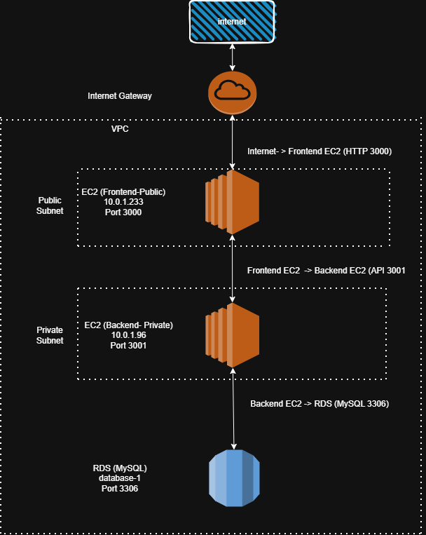
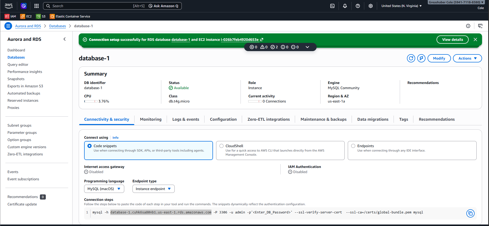
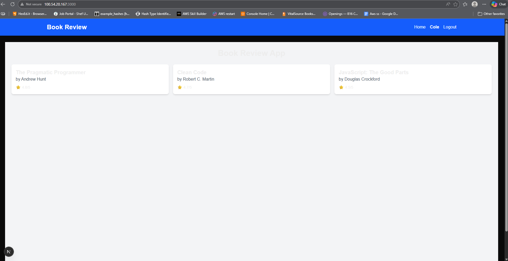

# AWS 3-Tier Web Architecture

This project demonstrates a 3-tier web application deployed on AWS using EC2 and RDS.

## Architecture

Internet → Internet Gateway → VPC → Frontend EC2 → Backend EC2 → Amazon RDS

Frontend:
- EC2 instance
- Next.js application
- Port 3000

Backend:
- EC2 instance
- Node.js API
- Port 3001

Database:
- Amazon RDS MySQL
- Port 3306

## Architecture Diagram

## Infrastructure

### EC2 Instances
.png)
.png)

### RDS Database

### Security Groups
.png)
.png)
.png)
.png)
.png)
.png)

### Application Running

## Key Concepts Demonstrated

This project demonstrates several fundamental AWS cloud architecture concepts:

### 3-Tier Architecture
The application is separated into three independent layers:

Frontend Layer  
- Next.js application hosted on an EC2 instance  
- Receives traffic from the internet on port 3000

Backend Layer  
- Node.js API hosted on a separate EC2 instance  
- Handles application logic and communicates with the database

Database Layer  
- Amazon RDS MySQL database  
- Stores application data and is only accessible from the backend tier

### VPC Networking
The infrastructure is deployed inside a Virtual Private Cloud (VPC):

- Internet Gateway allows inbound traffic to the public subnet
- Frontend EC2 is placed in a public subnet
- Backend EC2 and RDS are placed in a private subnet
- Security groups restrict communication between tiers

### Security Controls
Network access is restricted using security groups:

- Internet → Frontend EC2 (HTTP port 3000)
- Frontend EC2 → Backend EC2 (API port 3001)
- Backend EC2 → RDS MySQL (port 3306)

This ensures the database cannot be accessed directly from the internet.

### Deployment and Troubleshooting
During deployment several operational tasks were performed:

- Installed Node.js runtime on EC2 instances
- Configured environment variables for database connectivity
- Troubleshot API connectivity between tiers
- Verified database access from the backend server

- ## Acknowledgments

This project was implemented by following and adapting the tutorial below:

- https://github.com/pravinmishraaws/book-review-app

The deployment, configuration, troubleshooting, and documentation were completed independently to understand AWS 3-tier architecture concepts.
